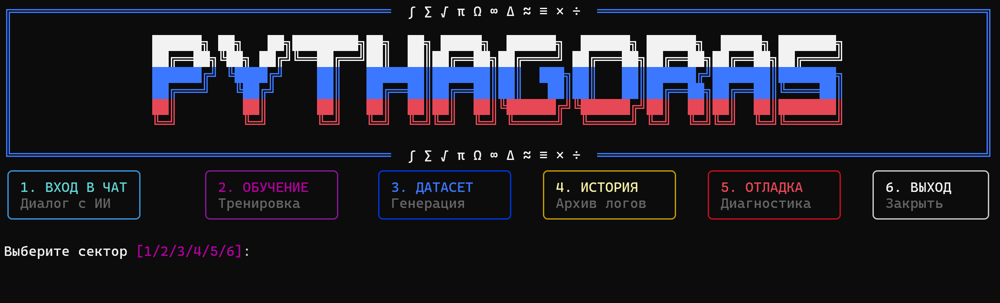

<p align="center">
  
</p>

# 📐 Pythagoras 1.0 — Quantum Neural Engine

[](https://github.com/your-username/pythagoras-1.0)
[](https://www.python.org/)
[](https://pytorch.org/)
[](https://opensource.org/licenses/MIT)

> **Pythagoras 1.0** — это специализированная ветка экосистемы **Tolstoy AI Studio (TAS Beta)**, сфокусированная на высокоточных арифметических вычислениях и логическом выводе.
<br>

### 🔗 [Официальный лендинг проекта](https://zzzigrok.github.io/Pythagoras-1.0/)



---

## 🔭 Обзор проекта

Pythagoras представляет собой компактную, но мощную языковую модель (SimpleLLM) на архитектуре **Transformer-Decoder**. В отличие от общих моделей, Pythagoras использует посимвольную токенизацию, что позволяет ей "понимать" каждый разряд числа и успешно справляться с операциями сложения и вычитания в пределах 0-999 (с результатами до 1998).

Проект интегрирован в общую структуру **AI Studio**, заимствуя лучшие практики визуализации и управления из `Tolstoy-CLI`, но предлагая уникальные инструменты валидации математической точности.

---

## 🚀 Быстрый старт

### 1. Установка зависимостей
Убедитесь, что у вас установлен Python 3.10+ и PyTorch. Установите необходимые библиотеки:

```bash
pip install -r requirements.txt
```

### 2. Подготовка данных
Для обучения модели необходим математический датасет. Вы можете сгенерировать его напрямую через HUB (пункт меню «ДАТАСЕТ»):

```bash
python pythagoras_hub.py
```
*Это создаст сбалансированный набор из 600,000 примеров в папке `data/`.*

### 3. Запуск Хаба
Pythagoras поставляется с единым центром управления. Запустите его для доступа ко всем функциям:

```bash
python pythagoras_hub.py
```

В главном меню вы сможете:
1. **Вход в чат** — начать диалог с моделью (требуются веса в `weights/`).
2. **Обучение** — запустить процесс обучения с нуля.
3. **История** — просмотреть логи прошлых сессий (в `logs/`).
4. **Отладка** — запустить глубокую диагностику и валидацию.

---

## 📂 Структура проекта

```text
Pythagoras 1.0/
├── data/           # Математические датасеты
├── docs/           # Техническая документация
├── logs/           # История чатов и логи
├── src/            # Исходный код (Prep)
├── weights/        # Веса модели и вокабуляр
├── LICENSE         # Лицензия MIT
├── README.md       # Описание проекта
├── pythagoras_hub.py # Основной файл запуска (HUB)
└── requirements.txt # Зависимости
```

---

## 📊 Основные характеристики

- **Параметров**: ~4.8M
- **Слоев**: 6
- **Голов внимания**: 8
- **Размер эмбеддинга**: 256
- **Контекст**: 64 символа
- **Токенизация**: Chars (посимвольная)

---

## 🏛️ Связь с Tolstoy AI (TAS)

Pythagoras 1.0 является неотъемлемой частью **TAS Beta (Tolstoy AI Studio)**. 
- **Визуальный стиль**: Использует те же компоненты `rich`, что и `Tolstoy-CLI`.
- **Логика обучения**: Архитектура трейнера и использование накопления градиентов синхронизированы с флагманскими моделями серии Tolstoy.
- **Специализация**: В рамках экосистемы Pythagoras выступает в роли "Логического модуля", демонстрируя, как малые модели могут превосходить гигантов в узкоспециализированных задачах.

---

## 📖 Документация

### 🎓 Для начинающих (Туториалы)

Мы подготовили специальную серию пошаговых руководств, написанных простым языком. Если вы только начинаете свой путь в ML, начните отсюда:


- [🧠 0. Что такое Машинное Обучение простыми словами?](docs/tutorials/0_what_is_ml.md) — базовые концепции без сложных терминов.

- [🚀 1. Быстрый старт](docs/tutorials/1_quick_start.md) — как запустить проект за 5 минут.

- [🗂 2. Свой датасет](docs/tutorials/2_custom_dataset.md) — как научить модель новым трюкам.

- [🏋️ 3. Руководство по обучению](docs/tutorials/3_training_guide.md) — как правильно тренировать нейросеть.

- [⚙️ 4. Гиперпараметры](docs/tutorials/4_hyperparameters.md) — настройка "мозга" модели.

- [🛠️ 5. Режим отладки](docs/tutorials/5_debug_mode.md) — как искать ошибки.

- [🤝 6. Как развивать проект?](docs/tutorials/6_how_to_contribute.md) — идеи для самостоятельной практики.


Для глубокого погружения в проект изучите файлы в папке `docs/`:

- [🏛️ Архитектура модели](docs/architecture.md) — математика и устройство сети.
- [⚙️ Механизм обучения](docs/trainer.md) — батчи, оптимизатор и циклы.
- [⚖️ Генератор датасета](docs/dataset.md) — как создаются сбалансированные знания.
- [🗂️ Структура проекта](docs/structure.md) — подробный разбор CLI и файлов.

---

<p align="center">
  <sub>Pythagoras 1.0 • Часть экосистемы Tolstoy AI Studio • 2026</sub>
</p>

