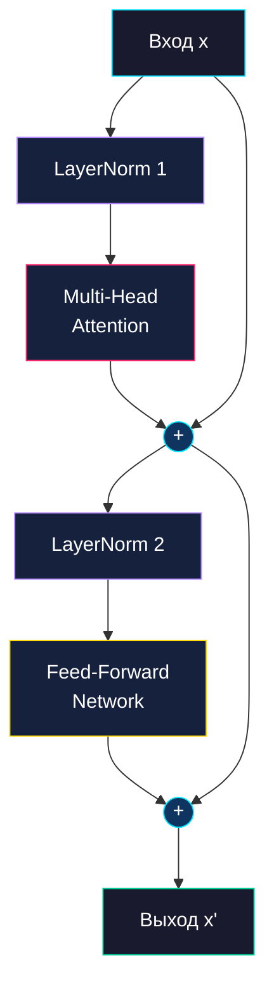
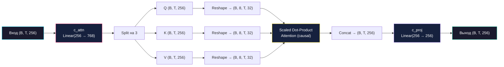
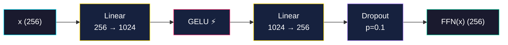
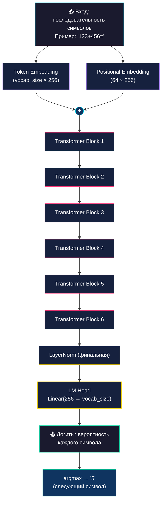

<p align="center">
  
</p>

# 🏛️ Архитектура модели Pythagoras v2.2

> **SimpleLLM** — авторегрессионная языковая модель, специализированная на арифметических вычислениях.
> Архитектура следует каноническому паттерну **Transformer-Decoder** (GPT-style).

---

## 📋 Оглавление

- [Обзор](#-обзор)
- [Гиперпараметры](#-гиперпараметры)
- [Токенизация](#-токенизация-character-level)
- [Архитектура сети](#-архитектура-сети)
  - [Эмбеддинги](#1-эмбеддинги)
  - [Transformer Block](#2-transformer-block)
  - [Multi-Head Attention](#3-multi-head-attention-mha)
  - [Feed-Forward Network](#4-feed-forward-network-ffn)
  - [Финальный слой](#5-финальный-слой-lm-head)
- [Математика алгоритма (Math Logic)](subdocs/math_logic.md)
- [Полная схема модели](#-полная-схема-модели)
- [Подсчёт параметров](#-подсчёт-параметров)

---

## 🔭 Обзор

Pythagoras — это **Decoder-only Transformer**, обученный предсказывать следующий символ в математическом выражении. Вместо работы с естественным языком модель оперирует арифметическими последовательностями вида `123+456=579`.

**Ключевое отличие от языковых моделей**: здесь используется **посимвольная токенизация** (Character-level). Каждая цифра, знак операции и символ `=` — отдельный токен. Это принципиально важно для математики: модель «видит» каждый разряд числа и учится правилам переноса (carry) и заимствования (borrow).

---

## ⚙️ Гиперпараметры

| Параметр | Значение | Описание |
| :--- | :---: | :--- |
| `n_embd` | **256** | Размерность скрытого состояния (embedding dimension) |
| `n_head` | **8** | Количество голов внимания |
| `n_layer` | **6** | Количество слоёв Transformer |
| `block_size` | **64** | Максимальная длина контекста (в символах) |
| `dropout` | **0.1** | Вероятность отключения нейрона при обучении |
| `head_size` | **32** | Размерность одной головы = `n_embd / n_head` |

> [!NOTE]
> Контекстное окно в 64 символа более чем достаточно для выражений с трёхзначными числами (например, `999+999=1998\n` = 14 символов).

---

## 🔤 Токенизация (Character-level)

В отличие от BPE/WordPiece, Pythagoras использует **посимвольный словарь**. Каждый уникальный символ в обучающем датасете получает свой числовой индекс.

**Пример словаря** (для датасета с примерами сложения и вычитания):

| Символ | Индекс | Назначение |
| :---: | :---: | :--- |
| `\n` | 0 | Разделитель примеров |
| `+` | 1 | Операция сложения |
| `-` | 2 | Операция вычитания |
| `=` | 3 | Разделитель «выражение → ответ» |
| `0`–`9` | 4–13 | Цифры |

Словарь сохраняется в файл `math_vocab.pkl` в виде двух словарей:
- **`stoi`** (string → index): `{'0': 4, '1': 5, '+': 1, ...}`
- **`itos`** (index → string): `{4: '0', 5: '1', 1: '+', ...}`

> [!TIP]
> **Почему не BPE?** Для арифметики важно, чтобы модель обрабатывала **каждый разряд числа отдельно**. BPE может объединить `12` в один токен, и тогда модель не увидит отдельные цифры `1` и `2`, что критично для операций переноса.

---

## 🧱 Архитектура сети

### 1. Эмбеддинги

Модель использует **два типа эмбеддингов**, которые складываются поэлементно:

```
x = TokenEmbedding(input) + PositionalEmbedding(position)
```

- **Token Embedding** (`nn.Embedding(vocab_size, 256)`) — преобразует каждый символ в вектор размерности 256. Модель учится ассоциировать, например, символ `7` с определённым направлением в 256-мерном пространстве.

- **Positional Embedding** (`nn.Embedding(64, 256)`) — обучаемые позиционные эмбеддинги. Сообщают модели *где* в последовательности находится каждый символ (первый, второй, третий...). Без них модель не различала бы `12+3` и `21+3`.

$$x_i = E_{token}(c_i) + E_{pos}(i)$$

где $c_i$ — символ на позиции $i$, $E_{token}$ — матрица размером $|V| \times d$, $E_{pos}$ — матрица размером $T \times d$.

### 2. Transformer Block

Каждый из **6 слоёв** модели представляет собой Transformer Block с **Pre-Norm** архитектурой и **остаточными связями** (residual connections):



**Формулы блока:**

$$x = x + \text{MultiHeadAttention}(\text{LayerNorm}(x))$$

$$x = x + \text{FFN}(\text{LayerNorm}(x))$$

> [!IMPORTANT]
> **Остаточные связи** (символ `+`) критически важны: без них градиенты затухают при прохождении через 6 слоёв, и модель не обучается. Они позволяют информации «перепрыгивать» через слои.

### 3. Multi-Head Attention (MHA)

Механизм внимания позволяет каждому символу «видеть» все предыдущие символы и учитывать их при формировании своего представления.

**Шаги работы:**

1. Линейная проекция входа в три вектора — **Query**, **Key**, **Value**:

$$Q, K, V = xW_Q,\; xW_K,\; xW_V$$

   На практике используется один объединённый слой `c_attn` размером $d \to 3d$, результат которого разрезается на три части.

2. Разбиение на **8 голов**: каждый вектор размерности 256 делится на 8 частей по 32.

3. Вычисление внимания в каждой голове (подробнее — в [следующем разделе](#-математика-механизма-внимания)).

4. Конкатенация результатов всех голов и финальная проекция через `c_proj`.



> [!NOTE]
> В реализации используется PyTorch `F.scaled_dot_product_attention` с флагом `is_causal=True`, что автоматически применяет **каузальную маску** — модель видит только предшествующие символы и не может «подглядывать» в ответ.

### 4. Feed-Forward Network (FFN)

Каждый блок содержит полносвязную сеть, работающую **поэлементно** (по каждому токену независимо):

$$\text{FFN}(x) = \text{Dropout}(W_2 \cdot \text{GELU}(W_1 \cdot x))$$

Где:
- $W_1$: линейный слой `256 → 1024` (расширение в 4 раза)
- **GELU** — функция активации (мягкая версия ReLU)
- $W_2$: линейный слой `1024 → 256` (сжатие обратно)
- **Dropout** — регуляризация (p=0.1)



> [!TIP]
> **Зачем расширение в 4 раза?** Внимание — это механизм «коммуникации» между токенами, а FFN — механизм «размышления» каждого токена. Расширение до 1024 нейронов даёт сети больше «мыслительных мощностей» для преобразования информации.

### 5. Финальный слой (LM Head)

После прохождения всех 6 блоков:

1. **LayerNorm** — финальная нормализация.
2. **Linear** (`256 → vocab_size`) — проекция на размер словаря. Каждый элемент выходного вектора — это **логит** (ненормализованная вероятность) того, что следующим символом будет конкретный символ из словаря.

$$\text{logits} = W_{lm} \cdot \text{LayerNorm}(x_{final})$$

При генерации берётся `argmax` логитов — символ с максимальной вероятностью.

---

## 📐 Математика механизма внимания

Ядро всей модели — формула **Scaled Dot-Product Attention**:

$$\text{Attention}(Q, K, V) = \text{softmax}\left(\frac{QK^T}{\sqrt{d_k}}\right) V$$

Разберём по шагам:

1. **$QK^T$** — матричное умножение запросов на ключи. Результат — матрица «баллов внимания», где элемент $(i, j)$ показывает, насколько символ на позиции $i$ считает «релевантным» символ на позиции $j$.

2. **$\frac{1}{\sqrt{d_k}}$** — масштабирование. Без него при большом $d_k = 32$ скалярные произведения становятся слишком большими, и softmax «насыщается» (все вероятности уходят к 0 или 1). Деление на $\sqrt{32} \approx 5.66$ стабилизирует градиенты.

3. **Каузальная маска** — перед softmax элементы $(i, j)$ где $j > i$ устанавливаются в $-\infty$. Это гарантирует, что при предсказании символа $i$ модель не видит будущие символы.

4. **Softmax** — превращает баллы в вероятности (сумма по строке = 1).

5. **Умножение на $V$** — каждый токен получает взвешенную сумму значений всех предыдущих токенов.

**Пример** (упрощённый). Для выражения `25+`:

| | `2` | `5` | `+` |
|---|---|---|---|
| **`2`** | 1.0 | 0.0 | 0.0 |
| **`5`** | 0.3 | 0.7 | 0.0 |
| **`+`** | 0.2 | 0.4 | 0.4 |

Символ `+` «обращает внимание» на оба числа (`2` и `5`) — он знает, что должен сложить 25 с чем-то.

---

## 🔍 Полная схема модели



---

## 📊 Подсчёт параметров

| Компонент | Формула | Параметров |
| :--- | :--- | ---: |
| Token Embedding | $V \times d = 14 \times 256$ | 3 584 |
| Positional Embedding | $T \times d = 64 \times 256$ | 16 384 |
| **× 6 блоков:** | | |
| ┣ c_attn (Q, K, V) | $d \times 3d = 256 \times 768$ | 196 608 |
| ┣ c_proj | $d \times d + d = 256 \times 256 + 256$ | 65 792 |
| ┣ FFN W1 | $d \times 4d + 4d = 256 \times 1024 + 1024$ | 263 168 |
| ┣ FFN W2 | $4d \times d + d = 1024 \times 256 + 256$ | 262 400 |
| ┣ LayerNorm ×2 | $2 \times 2d = 2 \times 512$ | 1 024 |
| Final LayerNorm | $2d = 512$ | 512 |
| LM Head | $d \times V + V = 256 \times 14 + 14$ | 3 598 |
| | | |
| **ИТОГО** | | **~4.8M** |

> [!NOTE]
> Размер словаря $V$ зависит от конкретного датасета (обычно ~14 символов для задач сложения/вычитания). Точное число параметров может незначительно варьироваться.

---

<p align="center">
  <sub>Pythagoras 1.0 • Документация архитектуры • 2026</sub>
</p>
