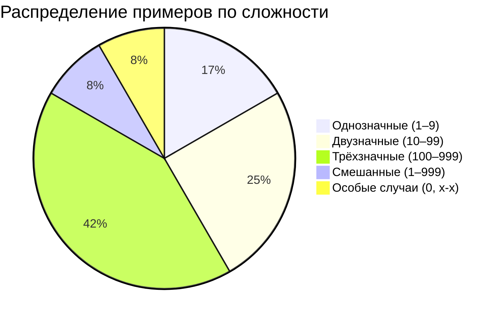
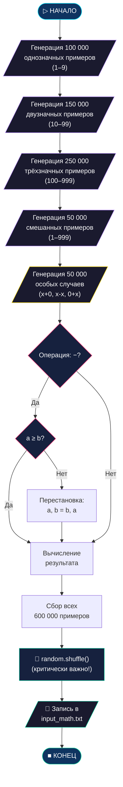

<p align="center">
  
</p>

# 📐 Генератор датасета — `prep_math.py`

> Скрипт формирует **сбалансированный обучающий датасет** арифметических примеров.
> Качество датасета напрямую влияет на точность модели: неправильное распределение примеров
> приводит к тому, что модель запоминает лёгкие случаи и игнорирует сложные.

---

## 🎓 Введение для начинающих

> **Что такое Pythagoras?**
> Представьте, что вы учите ребенка математике. Вы показываете ему пример: `2 + 2 = `. Ребенок смотрит на числа, вспоминает правила, которые вы ему объясняли, и говорит: `4`.
>
> Pythagoras делает то же самое, но это не ребенок, а компьютерная программа, называемая **нейронной сетью**. Мы "показываем" ей сотни тысяч примеров сложения и вычитания, и она "учится" находить закономерности, чтобы решать новые, ранее не виданные ею примеры.
>
> Этот проект создан специально для того, чтобы показать вам, как магия Искусственного Интеллекта (ИИ) работает изнутри на простом и понятном примере — арифметике. Вам не нужно быть гением математики, чтобы разобраться! Мы пройдем весь путь вместе.


## 📋 Оглавление

- [Введение для начинающих](#-введение-для-начинающих)

- [Обзор](#-обзор)
- [Стратегия балансировки](#-стратегия-балансировки)
- [Конфигурация генерации](#-конфигурация-генерации)
- [Особые случаи](#-особые-случаи-edge-cases)
- [Перемешивание данных](#-перемешивание-данных)
- [Формат выходного файла](#-формат-выходного-файла)
- [Диаграмма процесса генерации](#-диаграмма-процесса-генерации)
- [Статистика датасета](#-статистика-датасета)

---

## 🔭 Обзор

`prep_math.py` решает фундаментальную проблему обучения нейросетей арифметике: если просто генерировать случайные числа от 0 до 999, то:
- **Трёхзначных чисел** (100–999) будет 900 штук → 90% примеров
- **Двузначных чисел** (10–99) будет 90 штук → 9% примеров
- **Однозначных чисел** (0–9) будет 10 штук → **1%** примеров

Модель почти не увидит простых случаев и не научится им.

Скрипт решает эту проблему через **контролируемую генерацию** с фиксированным количеством примеров для каждого уровня сложности.

---

## ⚖️ Стратегия балансировки

Генерация разделена на **блоки сложности**, каждый из которых получает гарантированную квоту примеров:



### Почему именно такие пропорции?

| Блок | Количество | Обоснование |
| :--- | :---: | :--- |
| Однозначные | 100 000 | Фундамент — модель должна идеально знать `0+1=1`, `9-3=6` |
| Двузначные | 150 000 | Здесь появляется перенос разряда: `15+27=42` |
| Трёхзначные | 250 000 | Самый сложный уровень — наибольшая квота |
| Смешанные | 50 000 | Учат модель работать с разной разрядностью: `5+999=1004` |
| Особые случаи | 50 000 | Обучение свойствам нуля и тождеств |

---

## 📊 Конфигурация генерации

Каждый блок определяется тройкой `(min_value, max_value, count)`:

```python
configs = [
    (1, 9, 100000),      # 100к однозначных
    (10, 99, 150000),    # 150к двузначных
    (100, 999, 250000),  # 250к трёхзначных
    (1, 999, 50000),     # 50к смешанных
]
```

Для каждого примера:
1. Генерируется два случайных числа $a$ и $b$ в заданном диапазоне.
2. Случайно выбирается операция: `+` или `-`.
3. **Если операция — вычитание**, гарантируется $a \geq b$ (перестановкой), чтобы исключить отрицательные результаты.

$$\text{result} = \begin{cases} a + b & \text{если операция } + \\ a - b & \text{если операция } - \text{ и } a \geq b \end{cases}$$

> [!IMPORTANT]
> **Отсутствие отрицательных чисел** — осознанное решение. Посимвольный токенизатор не знает символ `-` в позиции ответа (он видит его только как оператор), и введение отрицательных результатов потребовало бы дополнительных данных и усложнения архитектуры.

---

## 🎯 Особые случаи (Edge Cases)

Дополнительные **50 000 примеров** посвящены свойствам нуля и тождествам:

| Паттерн | Пример | Чему учит модель |
| :--- | :--- | :--- |
| $x + 0$ | `42+0=42` | Нейтральный элемент сложения |
| $0 + x$ | `0+42=42` | Коммутативность с нулём |
| $x - 0$ | `42-0=42` | Нейтральный элемент вычитания |
| $x - x$ | `42-42=0` | Любое число минус себя = 0 |

```python
for _ in range(50000):
    a = random.randint(0, 999)
    case = random.choice([
        (a, 0, '+'),  # x + 0
        (a, 0, '-'),  # x - 0
        (a, a, '-'),  # x - x → 0
        (0, a, '+'),  # 0 + x
    ])
```

> [!TIP]
> Без этого блока модель часто ошибается в примерах вроде `100-100=`, выдавая ненулевые ответы. Выделение 10% датасета под edge-cases решает эту проблему.

---

## 🔀 Перемешивание данных

После генерации всех примеров производится **глобальное перемешивание**:

```python
random.shuffle(examples)
```

> [!WARNING]
> **Без перемешивания модель работает значительно хуже!** Если подать примеры последовательно (сначала 100к однозначных, потом 150к двузначных и т.д.), произойдёт **катастрофическое забывание** (catastrophic forgetting): обучаясь на трёхзначных примерах, модель «забудет» однозначные.

Перемешивание гарантирует, что на каждой итерации обучения модель видит **случайную смесь** примеров разной сложности.

---

## 📄 Формат выходного файла

Результат записывается в `input_math.txt`. Каждая строка — один пример:

```
437+215=652
88-21=67
0+750=750
300-300=0
15+9=24
```

**Формат строки:**

```
<операнд_A><оператор><операнд_B>=<результат>\n
```

| Компонент | Описание | Возможные значения |
| :--- | :--- | :--- |
| `операнд_A` | Первое число | 0–999 (до 1998 в ответе) |
| `оператор` | Арифметическая операция | `+` или `-` |
| `операнд_B` | Второе число | 0–999 |
| `=` | Разделитель | Фиксированный символ |
| `результат` | Ответ | 0–1998 |
| `\n` | Конец примера | Перевод строки |

---

## 🗺️ Диаграмма процесса генерации



---

## 📈 Статистика датасета

| Метрика | Значение |
| :--- | ---: |
| **Всего примеров** | 600 000 |
| **Размер файла** | ~6.7 МБ |
| **Уникальных символов (vocab)** | ~14 |
| **Операция `+`** | ~50% |
| **Операция `-`** | ~50% |
| **Примеры с нулём** | ~8% (50 000) |
| **Максимальный результат** | 1998 (999+999) |
| **Минимальный результат** | 0 |

---

## 🚀 Использование

```bash
# Автономный запуск
python prep_math.py

# Или через главное меню pythagoras_hub.py
# Меню "Обучение" → "Сгенерировать новые данные? [y/n]"
```

Результат:
```
⚖️ Генерируем идеально сбалансированный датасет...
✅ Создано 600000 сбалансированных примеров в 'input_math.txt'
```

---

<p align="center">
  <sub>Pythagoras 1.0 • Документация датасета • 2026</sub>
</p>
