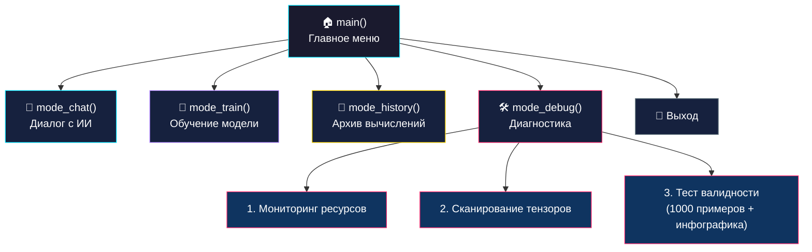
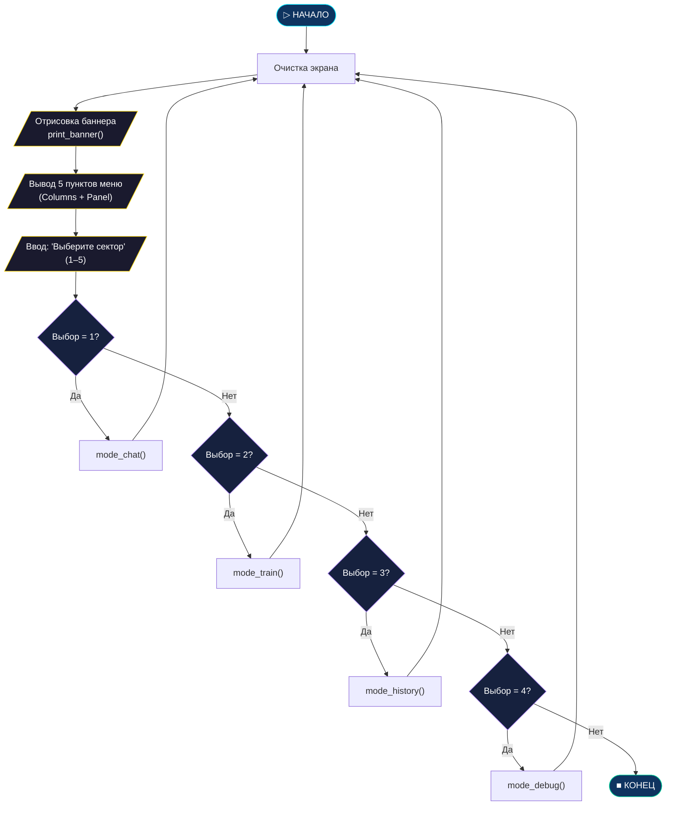
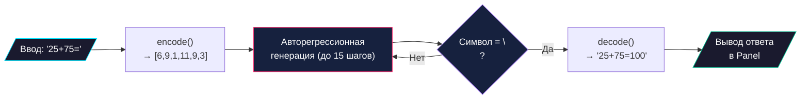

<p align="center">
  
</p>

# 🗂️ Структура CLI-инструмента Pythagoras

> Описание программной архитектуры `pythagoras_hub.py` — единого интерфейса для работы с моделью.

---

## 🎓 Введение для начинающих

> **Что такое Pythagoras?**
> Представьте, что вы учите ребенка математике. Вы показываете ему пример: `2 + 2 = `. Ребенок смотрит на числа, вспоминает правила, которые вы ему объясняли, и говорит: `4`.
>
> Pythagoras делает то же самое, но это не ребенок, а компьютерная программа, называемая **нейронной сетью**. Мы "показываем" ей сотни тысяч примеров сложения и вычитания, и она "учится" находить закономерности, чтобы решать новые, ранее не виданные ею примеры.
>
> Этот проект создан специально для того, чтобы показать вам, как магия Искусственного Интеллекта (ИИ) работает изнутри на простом и понятном примере — арифметике. Вам не нужно быть гением математики, чтобы разобраться! Мы пройдем весь путь вместе.


## 📋 Оглавление

- [Введение для начинающих](#-введение-для-начинающих)

- [Файловая структура проекта](#-файловая-структура-проекта)
- [Зависимости](#-зависимости)
- [Функциональные блоки](#-функциональные-блоки)
- [Блок-схема главного меню](#-блок-схема-главного-меню)
- [Описание режимов](#-описание-режимов)

---

## 📁 Файловая структура проекта

```
Pythagoras 1.0/
├── pythagoras_hub.py        # 🎯 Главный CLI (все режимы в одном файле)
├── prep_math.py             # Генератор сбалансированного датасета
├── train_math.py            # Обучение (минимальная версия)
├── train_math_rich.py       # Обучение (с Rich UI дашбордом)
├── chat_math.py             # Чат (минимальная версия)
├── chat_math_rich.py        # Чат (с Rich UI)
├── cfg.txt                  # Заметки по конфигурации
├── input_math.txt           # 📦 Датасет (~6.7 МБ, 600к примеров)
├── math_vocab.pkl           # Словарь символов (stoi/itos)
├── math_model_weights.pth   # 💾 Обученные веса (~19 МБ)
├── math_chat_history.txt    # Лог диалогов
├── log.txt                  # Лог обучения
├── reports/                 # 📊 Автогенерируемые отчёты
│   ├── validation_results_*.csv
│   └── validation_patterns_*.png
├── first launch/            # Архив первых экспериментов
└── docs/                    # 📖 Документация
    ├── architecture.md
    ├── trainer.md
    ├── dataset.md
    └── structure.md          ← вы здесь
```

---

## 📦 Зависимости

| Библиотека | Назначение | Обязательна? |
| :--- | :--- | :---: |
| `torch` | Нейросетевое ядро, тензоры, GPU | ✅ |
| `rich` | Интерактивный CLI-интерфейс (панели, таблицы, прогресс-бары) | ✅ |
| `psutil` | Мониторинг CPU/RAM в режиме отладки | ✅ |
| `matplotlib` | Генерация PNG-диаграмм валидации | ⚠️ Опционально |
| `pickle` | Сериализация словаря и данных | ✅ (stdlib) |
| `csv` | Экспорт результатов валидации | ✅ (stdlib) |

---

## 🧩 Функциональные блоки

`pythagoras_hub.py` состоит из 4 основных режимов, объединённых главным меню:



---

## 🗺️ Блок-схема главного меню

Оформлена по ГОСТ 19.701-90 (ромбы — условия, параллелограммы — ввод/вывод, прямоугольники — действия):



---

## 📖 Описание режимов

### 1. `mode_chat()` — Диалог с ИИ

**Вход:** Пользователь вводит математическое выражение (например, `25+75=`).

**Процесс генерации:**



- Если пользователь не ввёл `=`, оно добавляется автоматически.
- Генерация останавливается при встрече символа `\n` или после 15 символов.
- Каждый ответ логируется в `math_chat_history.txt`.

### 2. `mode_train()` — Обучение модели

- Проверяет наличие `input_math.txt`; предлагает сгенерировать через `prep_math.py`.
- Запрашивает количество итераций (по умолчанию 5000).
- Запускает цикл обучения с **Live-дашбордом** Rich (номер итерации, loss, прогресс-бар).
- Сохраняет веса в `math_model_weights.pth`.

> Подробнее — см. [trainer.md](trainer.md).

### 3. `mode_history()` — Архив вычислений

- Читает последние **20 записей** из `math_chat_history.txt`.
- Парсит формат `[время] Запрос: ... | Ответ: ...`.
- Выводит в виде таблицы Rich с колонками: Время, Запрос, Ответ.

### 4. `mode_debug()` — Центр отладки и диагностики

Подменю с 3 инструментами:

| № | Инструмент | Описание |
| :---: | :--- | :--- |
| 1 | **Мониторинг ресурсов** | Загрузка CPU, использование RAM/VRAM, число потоков torch |
| 2 | **Сканирование тензоров** | Загружает веса и выводит таблицу всех слоёв с формами и количеством параметров |
| 3 | **Тест валидности** | Генерирует 1000 сбалансированных примеров, прогоняет через модель, выводит точность по паттернам. **Автоматически экспортирует** CSV-таблицу и PNG-диаграмму в `reports/` |

### 5. `generate_validation_report()` — Генерация инфографики

Вспомогательная функция, вызываемая из `mode_debug()` (пункт 3):

- **CSV** (`reports/validation_results_<timestamp>.csv`): полная таблица 1000 примеров с колонками №, Пример, Ожидание, Ответ ИИ, Статус, Паттерн. Кодировка UTF-8 BOM, разделитель `;` — совместимо с Excel.
- **PNG** (`reports/validation_patterns_<timestamp>.png`): два графика matplotlib — столбчатая диаграмма верных/ошибочных ответов и горизонтальный bar-chart точности по паттернам.

---

<p align="center">
  <sub>Pythagoras 1.0 • Документация структуры • 2026</sub>
</p>
