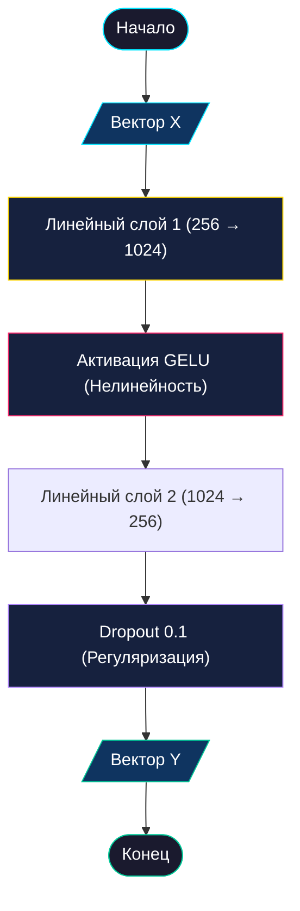

# 🧠 Полносвязная сеть прямого распространения (Feed-Forward Network)

> [!TIP]
> **Feed-Forward Network (FFN)** — это индивидуальный «мыслительный центр» каждого токена. В Pythagoras 1.0 этот блок отвечает за глубокую переработку математических абстракций.

---

## 📋 Оглавление
- [1. Общее назначение](#1-общее-назначение)
  - [💡 Аналогия из реальной жизни](#-аналогия-из-реальной-жизни)
  - [🧮 Почему это критично для математики?](#-почему-это-критично-для-математики)
- [2. Алгоритм работы](#2-алгоритм-работы)
  - [Схема процесса (ГОСТ)](#схема-процесса-гост)
  - [Детальный разбор шагов](#детальный-разбор-шагов)
  - [Пример реализации (PyTorch)](#пример-реализации-pytorch)
- [3. Глоссарий](#3-глоссарий)
- [4. FAQ](#4-faq)

---

## 1. Общее назначение

Если **Механизм Внимания** позволяет символам «разговаривать» друг с другом и собирать информацию, то **Feed-Forward** слой — это время, когда каждый символ замолкает и обрабатывает полученные данные в одиночку.

### 💡 Аналогия из реальной жизни
Представьте, что вы — детектив. 
1.  **Внимание**: Вы опросили всех свидетелей и собрали кучу улик. 
2.  **Feed-Forward**: Вы заперлись в кабинете, разложили улики на столе и начали строить логические цепочки, чтобы найти преступника. 

FFN — это как раз тот самый кабинет, где из разрозненных фактов (контекста) рождается четкий вывод.

### 🧮 Почему это критично для математики?
Математические правила требуют нелинейной логики. Например:
- «Если сумма в этом разряде > 9, то я должен оставить здесь только остаток, а 1 передать дальше».
- «Если я вижу знак минус, я должен инвертировать логику сложения».

Такие сложные логические условия «ЕСЛИ -> ТО» невозможно реализовать простым сложением векторов. Нужна мощная сеть с функцией активации (GELU), которая сможет «вычислить» эти правила внутри своих скрытых слоев.

---

## 2. Алгоритм работы

Блок FFN в Pythagoras 1.0 работает по принципу «Расширение → Активация → Сжатие».

### Схема процесса (ГОСТ 19.701-90)



### Детальный разбор шагов

1.  **Расширение (Projection Up)**: Мы увеличиваем размерность вектора в 4 раза (с 256 до 1024). 
    > [!NOTE]
    > Это нужно для того, чтобы дать нейросети больше «места для размышлений». В 1024-мерном пространстве гораздо проще разделить разные математические случаи.
2.  **Активация GELU**: Это сердце блока. Функция GELU пропускает положительные значения и мягко подавляет отрицательные. Это позволяет сети обучаться сложным зависимостям.
3.  **Сжатие (Projection Down)**: Мы возвращаем данные в стандартный размер 256, чтобы их можно было передать в следующий блок Трансформера.
4.  **Dropout**: Мы случайно «выключаем» 10% нейронов. Это заставляет сеть быть гибкой и не полагаться на конкретные числа, а учить общие правила арифметики.

### Пример реализации (PyTorch)

> [!NOTE]
> В реальном коде проекта (см. `pythagoras_hub.py` и др.) FFN не выносится в отдельный класс, а реализуется "inline" (напрямую) внутри Трансформерного блока с помощью `nn.Sequential` для лаконичности:

```python
# Фрагмент инициализации внутри class Block(nn.Module):
self.ffwd = nn.Sequential(
    # Расширяем: 256 -> 1024
    nn.Linear(n_embd, 4 * n_embd),
    # Оживляем: добавляем нелинейность
    nn.GELU(),
    # Сжимаем: 1024 -> 256
    nn.Linear(4 * n_embd, n_embd),
    # Регуляризуем: боремся с переобучением (dropout = 0.1)
    nn.Dropout(dropout)
)
```

**Как это применяется:**
В методе `forward` блока `Block` эта цепочка вызывается так же просто: `self.ffwd(self.ln2(x))`. Это применяется к каждому токену независимо и параллельно.

---

## 3. Глоссарий

| Термин | Простое объяснение |
| :--- | :--- |
| **GELU** | "Умный" переключатель. Решает, какие данные важны, а какие — шум. |
| **Linear Layer** | Слой, где числа умножаются на веса (знания модели). |
| **Dropout** | Временная "амнезия" для нейронов, чтобы модель не зубрила ответы. |
| **Projection Up** | Увеличение объема данных для детального анализа. |

---

## 4. FAQ

**В: Почему мы расширяем именно в 4 раза, а не в 10 или 2?**
О: Число 4 стало стандартом после выхода оригинальной статьи про Трансформеры. Опытным путем выяснилось, что этого достаточно для большинства задач. Меньше 4 — модели не хватает "ума", больше 4 — она становится слишком тяжелой и медленной.

**В: Влияет ли FFN на "память" модели?**
О: Скорее на "интеллект". Внимание — это память о контексте, а FFN — это правила его обработки.

**В: Что если убрать GELU?**
О: Сеть превратится в один большой линейный слой. Она сможет решать только самые простые задачи (уровня 1+1), но спасует перед любым примером с переносом разряда или отрицательными числами.

---
<p align="center">
  <a href="transformer_block.md">Далее: Трансформерный блок (Block) →</a><br/>
  <sub>Pythagoras 1.0 • Документация компонентов • 2026</sub>
</p>
