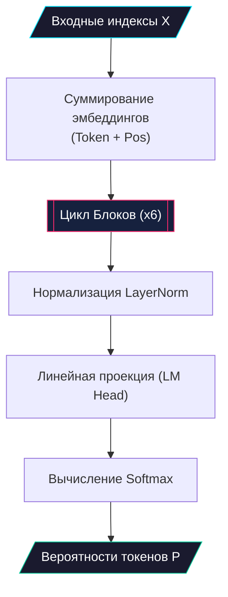

# 🧮 Математическая логика алгоритма (Math Logic)

> [!NOTE]
> В данном разделе описываются математические основы архитектуры Pythagoras 1.0, включая формулы преобразований, расчеты размерностей и функции активации.

---

## 📋 Оглавление
- [1. Входные преобразования](#1-входные-преобразования)
  - [Эмбеддинги](#эмбеддинги)
- [2. Механизм внимания (MHA)](#2-механизм-внимания-mha)
  - [Формула Scaled Dot-Product Attention](#формула-scaled-dot-product-attention)
  - [Каузальное маскирование](#каузальное-маскирование)
- [3. Полносвязная сеть (FFN)](#3-полносвязная-сеть-ffn)
  - [Функция активации GELU](#функция-активации-gelu)
- [4. Обучение и потери](#4-обучение-и-потери)
  - [Cross-Entropy Loss](#cross-entropy-loss)

---

## 1. Входные преобразования

### Эмбеддинги
Входная последовательность индексов токенов $x \in \mathbb{Z}^{T}$ преобразуется в векторное пространство $\mathbb{R}^{T \times d}$.

$$E_{total} = E_{token}(x) + E_{pos}(p)$$

Где:
- $T$ — длина последовательности (block_size = 64).
- $d$ — размерность эмбеддинга (n_embd = 256).
- $p$ — вектор позиций $[0, 1, \dots, T-1]$.
- $E_{token} \in \mathbb{R}^{V \times d}$ — обучаемая матрица токенов.
- $E_{pos} \in \mathbb{R}^{T \times d}$ — обучаемая матрица позиций.

---

## 2. Механизм внимания (MHA)

### Формула Scaled Dot-Product Attention
Для каждой головы внимания вычисляется:

$$\text{Attention}(Q, K, V) = \text{softmax}\left(\frac{QK^T}{\sqrt{d_k}} + M\right)V$$

Где:
- $Q, K, V$ — матрицы запросов, ключей и значений.
- $d_k$ — размерность головы (head_size = 32).
- $M$ — маска (ахроматическая), где $M_{ij} = -\infty$ если $i < j$ (для декодера).

### Многоголовое объединение
$$\text{MultiHead}(Q, K, V) = \text{Concat}(\text{head}_1, \dots, \text{head}_h)W^O$$

Где $h = 8$ голов.

---

## 3. Полносвязная сеть (FFN)

Каждый токен обрабатывается независимо через два линейных слоя:

$$\text{FFN}(x) = \text{GELU}(xW_1 + b_1)W_2 + b_2$$

Размерности:
- $x \in \mathbb{R}^{1 \times 256}$
- $W_1 \in \mathbb{R}^{256 \times 1024}$ (расширение в 4 раза)
- $W_2 \in \mathbb{R}^{1024 \times 256}$

### Функция активации GELU
Используется аппроксимация:
$$\text{GELU}(x) = 0.5x \left(1 + \tanh\left(\sqrt{\frac{2}{\pi}}(x + 0.044715x^3)\right)\right)$$

---

## 4. Обучение и потери

### Cross-Entropy Loss
Минимизируется отрицательное логарифмическое правдоподобие для предсказания следующего токена:

$$\mathcal{L} = -\frac{1}{T} \sum_{t=1}^{T} \log P(y_t | x_{<t})$$

Где $y_t$ — истинный токен на позиции $t$, а $P$ — вероятность, выдаваемая слоем Softmax:
$$\text{Softmax}(z_i) = \frac{e^{z_i}}{\sum_{j} e^{z_j}}$$

---

## Схема математических потоков (ГОСТ 19.701-90)

---

  <a href="../architecture.md">← Вернуться к общей архитектуре</a> 
  Pythagoras 1.0 • Математическая документация • 2026

