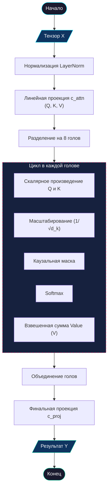

# 👀 Механизм многоголового внимания (Multi-Head Attention)

> [!IMPORTANT]
> **Multi-Head Attention** — это фундамент архитектуры Трансформера. В проекте Pythagoras 1.0 этот компонент выступает в роли «динамической памяти», позволяя модели фокусироваться на нужных цифрах в процессе вычисления.

---

## 📋 Оглавление
- [1. Общее назначение](#1-общее-назначение)
  - [💡 Аналогия из реальной жизни](#-аналогия-из-реальной-жизни)
  - [🧮 Почему это критично для математики?](#-почему-это-критично-для-математики)
- [2. Алгоритм работы](#2-алгоритм-работы)
  - [Схема процесса (ГОСТ)](#схема-процесса-гост)
  - [Детальный разбор шагов](#детальный-разбор-шагов)
  - [Пример реализации (PyTorch)](#пример-реализации-pytorch)
- [3. Глоссарий](#3-глоссарий)
- [4. FAQ](#4-faq)

---

## 1. Общее назначение

Механизм внимания позволяет каждому символу во входной строке (например, цифре или знаку `=`) «оценить» важность всех остальных символов для текущей задачи. Это не просто статичный просмотр данных, а активный поиск связей.

### 💡 Аналогия из реальной жизни
Представьте, что вы читаете сложную кулинарную книгу. Когда вы видите слово **«соль»** в инструкции, ваши глаза непроизвольно ищут в списке ингредиентов **«количество»** этой соли. Вы не перечитываете всю книгу — ваше **«внимание»** мгновенно связывает действие с нужным параметром.

В нейросети происходит то же самое: когда модель генерирует ответ после знака `=`, она «смотрит» на числа слева, чтобы найти их значения.

### 🧮 Почему это критично для математики?
Математика требует жесткой иерархии связей. При сложении в столбик:
1.  **Единицы** должны «видеть» только **единицы**.
2.  **Десятки** должны «видеть» не только **десятки**, но и возможный **перенос** из разряда единиц.
3.  **Знак операции** (`+` или `-`) должен «сообщить» всем цифрам, какую именно логику применять.

> [!TIP]
> Без внимания модель воспринимала бы `123+456` просто как набор символов, не понимая, что `3` и `6` связаны между собой общей операцией сложения в одном разряде.

---

## 2. Алгоритм работы

Работа внимания строится на поиске совпадений между **Запросами (Queries)** и **Ключами (Keys)**.

### Схема процесса (ГОСТ 19.701-90)



### Детальный разбор шагов

1.  **Проекция (Q, K, V)**: Модель превращает входной вектор каждого символа в три разных «представления». Одно говорит, что символ ищет (**Запрос**), второе — что он может предложить другим (**Ключ**), третье содержит саму информацию (**Значение**).
2.  **Скалярное произведение**: Мы умножаем Запросы на Ключи. Если Запрос одного символа совпал с Ключом другого — получается высокое число (сильная связь).
3.  **Масштабирование**: Чтобы числа не стали слишком большими (что ломает обучение), мы делим их на корень из размерности.
4.  **Каузальное маскирование**: 
    > [!WARNING]
    > Это критический момент. Мы заменяем значения «будущих» символов на минус бесконечность, чтобы Softmax превратил их в 0. Это гарантирует, что при предсказании `2+2=` модель не может видеть ответ `4`, даже если он есть в обучающих данных.

### Пример реализации (PyTorch)

> [!NOTE]
> В Pythagoras 1.0 используется оптимизированная функция `F.scaled_dot_product_attention`, которая значительно ускоряет вычисления и уменьшает потребление памяти по сравнению с ручной реализацией математики внимания.

```python
class MultiHeadAttention(nn.Module):
    def __init__(self, num_heads, head_size):
        super().__init__()
        self.num_heads, self.head_size = num_heads, head_size
        
        # Объединенный слой для проекций (Запросы, Ключи, Значения)
        # Размерность 3 * n_embd нужна, чтобы за один проход получить все три матрицы
        self.c_attn = nn.Linear(n_embd, 3 * n_embd, bias=False)
        
        # Слой для смешивания результатов всех голов обратно в единый вектор
        self.c_proj = nn.Linear(n_embd, n_embd)
        
        self.dropout = dropout

    def forward(self, x):
        B, T, C = x.shape # Batch (размер пакета), Time (длина), Channels (размерность)
        
        # Шаг 1: Получаем Q, K, V и разрезаем их (split)
        q, k, v = self.c_attn(x).split(n_embd, dim=2)
        
        # Шаг 2: Распределяем по головам
        # Меняем форму тензора с (B, T, C) на (B, T, num_heads, head_size)
        # Затем транспонируем (меняем местами оси 1 и 2) для удобства умножения
        q = q.view(B, T, self.num_heads, self.head_size).transpose(1, 2)
        k = k.view(B, T, self.num_heads, self.head_size).transpose(1, 2)
        v = v.view(B, T, self.num_heads, self.head_size).transpose(1, 2)
        
        # Шаг 3: Математика внимания (Q*K) с маской и масштабированием
        # PyTorch делает это одной быстрой C++ / CUDA функцией
        # is_causal=True автоматически накладывает маску, запрещающую смотреть вперед
        # dropout применяется только во время тренировки
        y = F.scaled_dot_product_attention(
            q, k, v, 
            is_causal=True, 
            dropout_p=self.dropout if self.training else 0.0
        )
        
        # Шаг 4: Склеиваем головы обратно
        # Возвращаем оси на место, делаем тензор непрерывным в памяти (contiguous) и меняем форму
        return self.c_proj(y.transpose(1, 2).contiguous().view(B, T, C))
```

---

## 3. Глоссарий

| Термин | Простое объяснение |
| :--- | :--- |
| **Токен** | Один символ (цифра, знак, пробел). |
| **Голова (Head)** | Независимый «взгляд» на данные. В Pythagoras их 8. |
| **Q (Query)** | Вектор-вопрос: «Где здесь десятки?» |
| **K (Key)** | Вектор-ответ: «Я — разряд десятков». |
| **V (Value)** | Вектор-данные: «Мое значение равно 5». |
| **Softmax** | Функция, превращающая баллы связей в проценты (сумма = 100%). |

---

## 4. FAQ

**В: Почему модель называется "Многоголовой" (Multi-Head)?**
О: Если бы у модели была только одна "голова", она могла бы фокусироваться только на чем-то одном (например, только на цифрах). 8 голов позволяют ей параллельно следить за цифрами, знаками операций, позициями разрядов и переносом единицы.

**В: Насколько сильно внимание влияет на точность?**
О: Напрямую. Если механизм внимания плохо обучен, модель будет путать разряды (например, прибавлять единицы к сотням) или «забывать» про знак минуса.

**В: Можно ли сделать 100 голов?**
О: Теоретически — да, но это замедлит работу и потребует огромного количества видеопамяти. Для математики в пределах 0-999 число 8 является оптимальным балансом.

---
<p align="center">
  <a href="feed_forward.md">Далее: Сеть прямого распространения (FFN) →</a><br/>
  <sub>Pythagoras 1.0 • Документация компонентов • 2026</sub>
</p>
