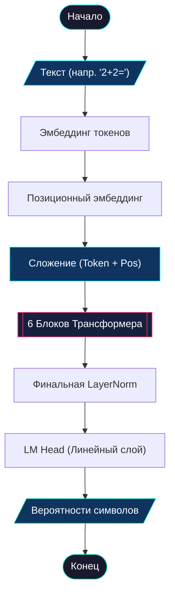

# 🏛️ Главная архитектура модели (SimpleLLM)

> [!NOTE]
> **SimpleLLM** — это координирующий центр всей системы Pythagoras 1.0. Он управляет превращением текста в математические векторы и обратно, обеспечивая пошаговую генерацию ответа.

---

## 📋 Оглавление
- [1. Общее назначение](#1-общее-назначение)
  - [💡 Аналогия из реальной жизни](#-аналогия-из-реальной-жизни)
  - [🧮 Почему это критично для математики?](#-почему-это-критично-для-математики)
- [2. Алгоритм работы](#2-алгоритм-работы)
  - [Схема процесса (ГОСТ)](#схема-процесса-гост)
  - [Детальный разбор шагов](#детальный-разбор-шагов)
  - [Пример реализации (PyTorch)](#пример-реализации-pytorch)
- [3. Глоссарий](#3-глоссарий)
- [4. FAQ](#4-faq)

---

## 1. Общее назначение

SimpleLLM — это «оболочка» (wrapper), которая собирает все компоненты (эмбеддинги, блоки, голову) в единый конвейер. Её задача — принять на вход строку символов и предсказать, какой символ должен идти следующим.

### 💡 Аналогия из реальной жизни
Представьте **писателя-переводчика**.
1.  **Словарь (Embeddings)**: Сначала он переводит каждое слово на специальный «язык идей» (числа).
2.  **Главы книги (Blocks)**: Затем он прогоняет эти идеи через 6 этапов редактирования, где каждая «глава» уточняет смысл.
3.  **Перо (LM Head)**: В конце он выбирает самое подходящее слово из своего запаса и записывает его на бумагу.

### 🧮 Почему это критично для математики?
Математика — это последовательность. Чтобы решить `10+10=20`, модель должна сначала понять, что `1` и `0` стоят вместе. 
SimpleLLM использует **Позиционные эмбеддинги**, которые дают модели «чувство пространства». Она буквально «знает», что одна цифра стоит в разряде единиц, а другая — в разряде десятков, просто исходя из их позиции в строке.

---

## 2. Алгоритм работы

Модель работает по принципу авторегрессии: предсказанный символ становится частью входа для следующего предсказания.

### Схема процесса (ГОСТ 19.701-90)



### Детальный разбор шагов

1.  **Эмбеддинг токенов**: Каждый символ превращается в вектор из 256 чисел. Это «багаж знаний» о символе.
2.  **Эмбеддинг позиций**: Мы добавляем информацию о том, ГДЕ стоит символ. Без этого модель не отличит `12` от `21`.
3.  **Проход через 6 блоков**: На каждом «этаже» данные уточняются с помощью внимания и логики.
4.  **LM Head**: Финальный слой превращает вектор 256 обратно в размер нашего словаря (например, 14 символов). Мы получаем оценку для каждой цифры: насколько вероятно, что это ответ.
5.  **Генерация**: Мы берем самый вероятный символ (например, `4`) и добавляем его к исходному тексту. Теперь вход — `2+2=4`. Модель делает еще один проход и выдает `\n` (конец примера).

### Пример реализации (PyTorch)

```python
class SimpleLLM(nn.Module):
    def __init__(self, vocab_size):
        super().__init__()
        # Матрицы знаний о символах и их позициях
        self.token_emb = nn.Embedding(vocab_size, n_embd)
        self.pos_emb = nn.Embedding(block_size, n_embd)
        
        # Основной вычислительный стек: 6 (n_layer) блоков Трансформера подряд
        self.blocks = nn.Sequential(*[Block() for _ in range(n_layer)])
        
        # Финальные штрихи: нормализация и проекция обратно в размер словаря
        self.ln_f = nn.LayerNorm(n_embd)
        self.lm_head = nn.Linear(n_embd, vocab_size)

    def forward(self, idx, targets=None):
        B, T = idx.shape
        
        # Шаг 1: Собираем "образ" каждого символа (смысл + позиция)
        # torch.arange(T, device=device) генерирует индексы [0, 1, ..., T-1]
        x = self.token_emb(idx) + self.pos_emb(torch.arange(T, device=device))
        
        # Шаг 2: Прогоняем через блоки "мыслители"
        x = self.blocks(x)
        
        # Шаг 3: Финальная нормализация и получение логитов (оценок) для каждого символа
        logits = self.lm_head(self.ln_f(x))
        
        # Шаг 4: Если мы учимся (есть targets), считаем ошибку (Loss)
        # Изменяем размерность (view), чтобы объединить Batch и Time для функции кросс-энтропии
        loss = F.cross_entropy(logits.view(-1, vocab_size), targets.view(-1)) if targets is not None else None
            
        return logits, loss
```

---

## 3. Глоссарий

| Термин | Простое объяснение |
| :--- | :--- |
| **Эмбеддинг** | Цифровой "отпечаток" символа. |
| **Позиционный эмбеддинг** | "Координата" символа в предложении. |
| **Логиты** | Сырые баллы-оценки. Чем выше балл, тем больше шанс выбора символа. |
| **Авторегрессия** | Способность модели использовать свои ответы для продолжения диалога. |
| **Vocab Size** | Размер словаря. У нас это ~14 (цифры + знаки + служебные). |

---

## 4. FAQ

**В: Почему модель предсказывает по одному символу, а не все сразу?**
О: Это природа Трансформера-декодера. Чтобы предсказать вторую цифру ответа (например, `0` в числе `20`), модели нужно «видеть» первую предсказанную цифру (`2`). Пошаговый подход позволяет модели учитывать собственные промежуточные выводы.

**В: Какую роль играет размер эмбеддинга (256)?**
О: Это «ширина канала» мысли. Если сделать его 2, модель сможет запомнить только «четное/нечетное». Размер 256 позволяет ей хранить в памяти сложные комбинации цифр и правила переноса.

**В: Можно ли использовать эту архитектуру для обычного текста?**
О: Да, Pythagoras — это полноценный GPT, просто очень маленький и специализированный. Если его обучить на книгах вместо математики, он будет генерировать текст.

---
<p align="center">
  <a href="../architecture.md">← Вернуться к общей архитектуре</a><br/>
  <sub>Pythagoras 1.0 • Документация компонентов • 2026</sub>
</p>
