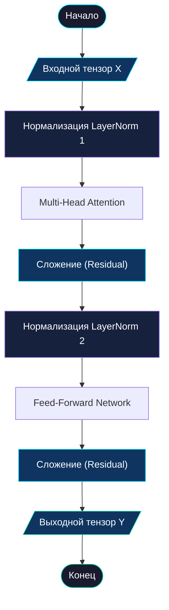

# 🧱 Трансформерный блок (Transformer Block)

> [!IMPORTANT]
> **Transformer Block** — это сердце архитектуры. Он объединяет механизмы внимания и мышления в единый, стабильный цикл. В Pythagoras 1.0 используется 6 таких блоков.

---

## 📋 Оглавление
- [1. Общее назначение](#1-общее-назначение)
  - [💡 Аналогия из реальной жизни](#-аналогия-из-реальной-жизни)
  - [🧮 Почему это критично для математики?](#-почему-это-критично-для-математики)
- [2. Алгоритм работы](#2-алгоритм-работы)
  - [Схема процесса (ГОСТ)](#схема-процесса-гост)
  - [Детальный разбор шагов](#детальный-разбор-шагов)
  - [Пример реализации (PyTorch)](#пример-реализации-pytorch)
- [3. Глоссарий](#3-глоссарий)
- [4. FAQ](#4-faq)

---

## 1. Общее назначение

Трансформерный блок — это универсальный вычислительный модуль. Информация проходит через него, обогащается контекстом от других символов и анализируется. Ключевая особенность блока — его «прозрачность»: благодаря специальным связям данные могут течь через 6 таких блоков без искажений.

### 💡 Аналогия из реальной жизни
Представьте **конвейер на заводе**.
1.  **Вход**: На ленту кладут чертеж детали.
2.  **Станция Внимания**: Рабочий сверяется с другими чертежами (соседними деталями).
3.  **Станция FFN**: Другой рабочий выполняет конкретную операцию (например, гнет металл).
4.  **Копия чертежа (Residual)**: Самое важное — на каждом этапе оригинальный чертеж сохраняется и передается дальше. Если рабочий ошибся, у нас всегда есть оригинал, чтобы поправить ситуацию.

### 🧮 Почему это критично для математики?
Глубокие нейросети страдают от «забывчивости» (затухания градиента). Если бы мы просто 6 раз умножали данные на матрицы, к концу шестого блока информация о том, что `123+456` начиналось с цифры `1`, могла бы стереться. 

Блок Трансформера использует **Residual Connections** (остаточные связи), которые позволяют модели «помнить» исходный пример на протяжении всего процесса вычислений.

---

## 2. Алгоритм работы

Блок Pythagoras 1.0 следует современной архитектуре **Pre-Norm**. Это значит, что мы сначала «причесываем» данные нормализацией, а только потом обрабатываем.

### Схема процесса (ГОСТ 19.701-90)



### Детальный разбор шагов

1.  **Нормализация 1 (LayerNorm)**: Мы приводим все числа в векторе к единому масштабу (среднее 0, отклонение 1). Это предотвращает «взрыв» или затухание чисел.
2.  **Внимание (MHA)**: Символ смотрит на соседей.
3.  **Первая остаточная связь (Add)**: Результат внимания **прибавляется** к исходному входу. 
    > [!IMPORTANT]
    > Это критически важно: если блок внимания решит, что в данный момент ничего важного нет, он выдаст 0, и благодаря сложению исходные данные пройдут через блок без изменений.
4.  **Нормализация 2**: Снова подравниваем данные перед сложными логическими операциями.
5.  **Мышление (FFN)**: Индивидуальная обработка токена.
6.  **Вторая остаточная связь**: Результат мышления прибавляется к данным.

### Пример реализации (PyTorch)

```python
class Block(nn.Module):
    def __init__(self):
        super().__init__()
        # Внимание: 8 голов (n_head), каждая размерностью 32 (n_embd // n_head)
        self.sa = MultiHeadAttention(n_head, n_embd // n_head)
        
        # Мышление (FFN): реализуется напрямую (inline) для лаконичности кода
        # Расширяем размерность в 4 раза, добавляем активацию GELU, сжимаем обратно
        self.ffwd = nn.Sequential(
            nn.Linear(n_embd, 4 * n_embd), 
            nn.GELU(), 
            nn.Linear(4 * n_embd, n_embd), 
            nn.Dropout(dropout)
        )
        
        # "Утюги" для разглаживания данных (инициализируем сразу оба)
        self.ln1, self.ln2 = nn.LayerNorm(n_embd), nn.LayerNorm(n_embd)

    def forward(self, x):
        # x = x + ... это и есть Residual Connection (остаточная связь)
        # Архитектура Pre-Norm: мы сначала нормализуем (ln1), потом применяем внимание
        x = x + self.sa(self.ln1(x))
        # Опять нормализуем (ln2) и применяем мышление (ffwd)
        x = x + self.ffwd(self.ln2(x))
        return x
```

---

## 3. Глоссарий

| Термин | Простое объяснение |
| :--- | :--- |
| **Residual Connection** | Операция `x + f(x)`. Позволяет данным «перепрыгивать» через слои. |
| **LayerNorm** | Математический «стабилизатор», удерживающий числа в узком диапазоне. |
| **Pre-Norm** | Стиль верстки блока, где нормализация идет ДО вычислений. Считается более стабильным. |
| **Слой (Layer)** | Отдельный этап внутри блока (внимание или FFN). |

---

## 4. FAQ

**В: Зачем складывать вход и выход? Не проще ли просто передать результат дальше?**
О: Нет. Представьте, что нейросеть — это очень длинная цепочка людей, передающих сообщение шепотом. К 6-му человеку сообщение исказится до неузнаваемости. Но если каждый человек будет не пересказывать сообщение, а **добавлять** к нему свои уточнения, оригинал сохранится гораздо лучше.

**В: Почему 6 блоков, а не один большой?**
О: Это как иерархия в компании. Первый блок видит простые связи (цифры), второй начинает понимать структуру примера, третий — логику сложения, и так далее. Глубина позволяет строить более сложные абстрактные рассуждения.

**В: Можно ли менять местами MHA и FFN?**
О: Теоретически можно, но практика показала, что схема «сначала коммуникация (MHA), потом размышление (FFN)» работает эффективнее всего.

---
<p align="center">
  <a href="simple_llm.md">Далее: Главная архитектура (SimpleLLM) →</a><br/>
  <sub>Pythagoras 1.0 • Документация компонентов • 2026</sub>
</p>
