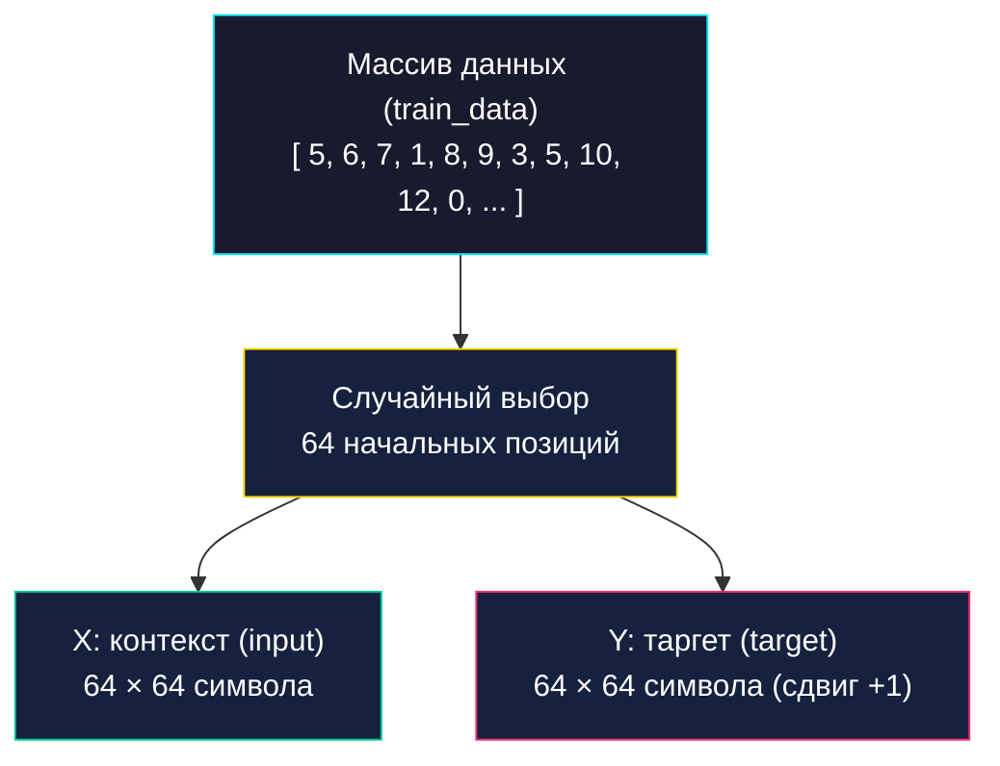
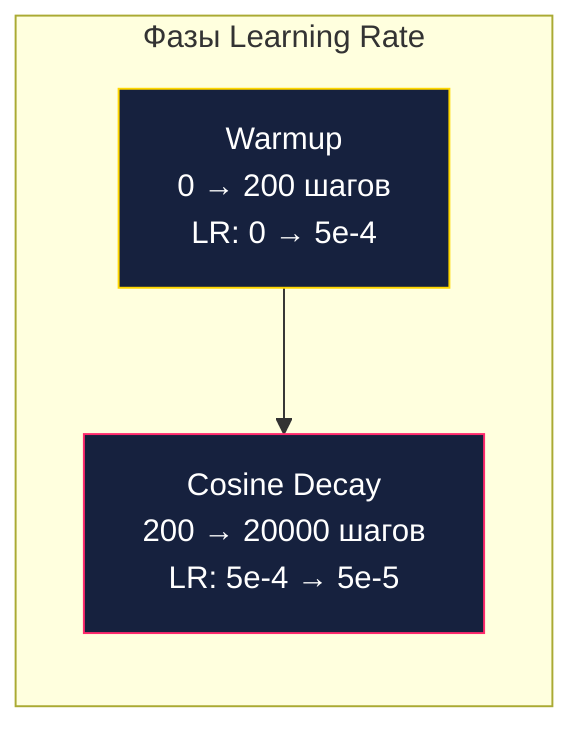
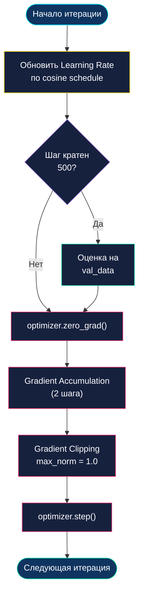
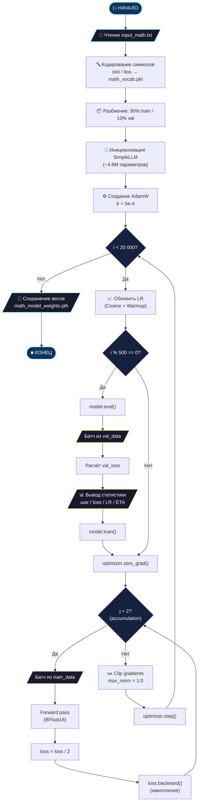

<p align="center">
  
</p>

# ⚙️ Механизм обучения Pythagoras v2.2

> Документ описывает весь цикл обучения модели: от подготовки тензоров до сохранения весов.
> Обучение реализовано в файлах `train_math.py` (минимальная версия) и `train_math_rich.py` (с Rich UI),
> а также интегрировано в `pythagoras_hub.py` (функция `mode_train()`).

---

## 📋 Оглавление

- [Обзор процесса](#-обзор-процесса)
- [Подготовка данных](#1-подготовка-данных)
- [Формирование батчей](#2-формирование-батчей)
- [Оптимизатор и Learning Rate](#3-оптимизатор-и-learning-rate)
- [Цикл обучения](#4-цикл-обучения)
- [Функция потерь](#5-функция-потерь-cross-entropy)
- [Gradient Accumulation](#6-gradient-accumulation)
- [Gradient Clipping](#7-gradient-clipping)
- [Валидация](#8-валидация)
- [Сохранение модели](#9-сохранение-модели)
- [Полная блок-схема](#-полная-блок-схема-обучения)

---

## 🔭 Обзор процесса


---

## 1. Подготовка данных

### Кодирование текста

Весь текст датасета (`input_math.txt`) считывается в память и конвертируется в последовательность целых чисел:

```python
chars = sorted(list(set(text)))  # Уникальные символы
stoi = { ch:i for i,ch in enumerate(chars) }  # Символ → Индекс
itos = { i:ch for i,ch in enumerate(chars) }  # Индекс → Символ
```

**Пример кодирования:**

```
Текст:    1 2 3 + 4 5 = 1 6 8 \n
Индексы:  5 6 7 1 8 9 3 5 10 12 0
```

Словарь сохраняется в `math_vocab.pkl` для использования при инференсе.

### Разбиение на выборки

Данные делятся в соотношении **90/10**:

$$n = \lfloor 0.9 \times |data| \rfloor$$

```python
train_data = data[:n]   # Первые 90% — для обучения
val_data   = data[n:]   # Последние 10% — для оценки
```

> [!NOTE]
> Разбиение выполняется **последовательно** (не случайно), так как в математическом датасете каждый пример независим и порядок не важен.

---

## 2. Формирование батчей

На каждой итерации формируется **батч** — набор случайных окон из массива данных.



**Ключевая идея** — таргет сдвинут на 1 символ вправо:

```
X: [ 1  2  3  +  4  5  =  ... ]  ← модель видит это
Y: [ 2  3  +  4  5  =  5  ... ]  ← модель должна предсказать это
```

То есть для каждой позиции $i$ модель учится предсказывать символ $i+1$.

**Реализация:**

```python
def get_batch(split):
    ds = train_data if split == 'train' else val_data
    ix = torch.randint(len(ds) - block_size, (batch_size,))  # 64 случайных позиции
    x = torch.stack([ds[i:i+block_size] for i in ix])        # Входы
    y = torch.stack([ds[i+1:i+block_size+1] for i in ix])    # Таргеты (сдвиг +1)
    return x.to(device), y.to(device)
```

**Параметры батча:**

| Параметр | Значение | Описание |
| :--- | :---: | :--- |
| `batch_size` | 64 | Количество примеров в одном батче |
| `block_size` | 64 | Длина контекстного окна (символов) |
| Тензор X | `(64, 64)` | 64 примера по 64 символа |
| Тензор Y | `(64, 64)` | Те же позиции, сдвинутые на 1 |

---

## 3. Оптимизатор и Learning Rate

### AdamW

Используется оптимизатор **AdamW** — модифицированная версия Adam с корректным weight decay:

$$\theta_{t+1} = \theta_t - \eta \left( \frac{\hat{m}_t}{\sqrt{\hat{v}_t} + \epsilon} + \lambda \theta_t \right)$$

где:
- $\theta_t$ — параметры модели на шаге $t$
- $\eta$ — learning rate
- $\hat{m}_t$, $\hat{v}_t$ — скорректированные моменты первого и второго порядка
- $\lambda$ — коэффициент weight decay

### Расписание Learning Rate (Cosine Annealing)

Learning rate изменяется по косинусному расписанию с линейным прогревом:



**Формула:**

$$\text{lr}(t) = \begin{cases} 
\text{lr}_{max} \times \frac{t}{T_{warmup}} & \text{если } t < T_{warmup} \\[8pt]
\text{lr}_{min} + \frac{1}{2}(\text{lr}_{max} - \text{lr}_{min})\left(1 + \cos\left(\pi \times \frac{t - T_{warmup}}{T_{max} - T_{warmup}}\right)\right) & \text{иначе}
\end{cases}$$

где:
- $T_{warmup} = 200$ (шаги прогрева)
- $\text{lr}_{max} = 5 \times 10^{-4}$
- $\text{lr}_{min} = 5 \times 10^{-5}$
- $T_{max} = 20\,000$

> [!TIP]
> **Зачем прогрев (warmup)?** На первых шагах веса инициализированы случайно, и большой learning rate может «выбросить» модель из зоны хороших решений. Плавное наращивание LR даёт модели время стабилизировать начальные градиенты.

---

## 4. Цикл обучения

На каждой итерации выполняются следующие шаги:



---

## 5. Функция потерь (Cross-Entropy)

Модель обучается через **кросс-энтропию** — стандартную функцию потерь для задач классификации:

$$\mathcal{L} = -\frac{1}{N}\sum_{i=1}^{N} \log P(y_i | x_i)$$

где:
- $N$ — общее количество предсказаний (batch_size × block_size)
- $P(y_i | x_i)$ — предсказанная вероятность правильного следующего символа $y_i$
- **Логиты** (выход модели) преобразуются в вероятности через softmax внутри `F.cross_entropy`

**Пример:**

Модель видит `25+` и должна предсказать следующий символ. Если правильный ответ — `7`, а модель выдаёт логиты `[0.1, 0.05, ..., 2.8, ...]` (где 2.8 соответствует `7`), то потеря будет низкой. Если бы модель ошиблась, потеря была бы высокой.

> [!IMPORTANT]
> Перед подачей в `cross_entropy` логиты и таргеты «разворачиваются» из формы `(B, T, V)` в `(B×T, V)`, чтобы каждая позиция обрабатывалась как отдельная задача классификации.

---

## 6. Gradient Accumulation

Для увеличения **эффективного размера батча** без увеличения потребления памяти используется **накопление градиентов**:

```python
gradient_accumulation_steps = 2  # Эффективный батч = 64 × 2 = 128
```

На каждой итерации:
1. Выполняются **2 прямых прохода** с разными мини-батчами.
2. Потеря каждого прохода **делится на 2**: `loss = loss / gradient_accumulation_steps`.
3. Градиенты **накапливаются** (суммируются) через `.backward()`.
4. Только после всех проходов вызывается `optimizer.step()`.

$$\text{Эффективный батч} = \text{batch\_size} \times \text{accumulation\_steps} = 64 \times 2 = 128$$

> [!TIP]
> Это позволяет имитировать обучение с батчем 128, используя память как для батча 64.

---

## 7. Gradient Clipping

Для предотвращения «взрыва градиентов» применяется обрезка:

```python
torch.nn.utils.clip_grad_norm_(model.parameters(), max_norm=1.0)
```

Если L2-норма всех градиентов превышает 1.0, все градиенты пропорционально уменьшаются:

$$g' = g \times \frac{\text{max\_norm}}{||g||_2} \quad \text{если } ||g||_2 > \text{max\_norm}$$

---

## 8. Валидация

Каждые **500 итераций** модель переключается в режим оценки (`model.eval()`) и вычисляет потерю на валидационной выборке:

```python
if iter % eval_interval == 0:
    model.eval()
    with torch.no_grad():
        x_val, y_val = get_batch('val')
        _, loss_val = model(x_val, y_val)
    model.train()
```

Валидационная потеря показывает, насколько хорошо модель **обобщает** — если она падает вместе с тренировочной, модель учится правильно. Если тренировочная падает, а валидационная растёт — это **переобучение**.

---

## 9. Сохранение модели

После завершения всех итераций веса сохраняются в файл:

```python
torch.save(model.state_dict(), 'math_model_weights.pth')
```

Файл `math_model_weights.pth` содержит **только обученные параметры** (словарь `{name: tensor}`), без архитектуры. Для загрузки необходимо сначала создать экземпляр модели с правильной конфигурацией.

---

## 🗺️ Полная блок-схема обучения



### Параметры обучения (сводка)

| Параметр | Значение | Описание |
| :--- | :---: | :--- |
| `max_iters` | 20 000 | Общее количество итераций |
| `batch_size` | 64 | Примеров в мини-батче |
| `gradient_accumulation` | 2 | Шаги накопления (эфф. батч = 128) |
| `learning_rate` | 5e-4 | Максимальный LR |
| `min_lr` | 5e-5 | Минимальный LR |
| `warmup` | 200 | Шаги прогрева |
| `eval_interval` | 500 | Частота оценки (итераций) |
| `grad_clip` | 1.0 | Порог обрезки нормы градиентов |
| `dtype` | BFloat16 | Тип данных при forward pass |
| `seed` | 42 | Фиксация генератора случайных чисел |

---

<p align="center">
  <sub>Pythagoras 1.0 • Документация обучения • 2026</sub>
</p>
