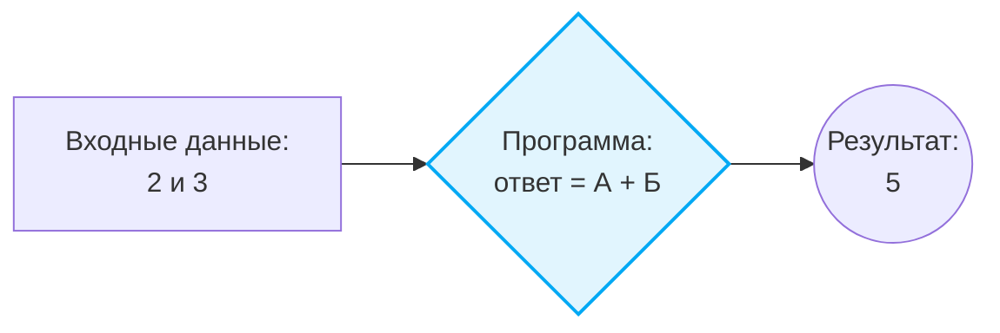
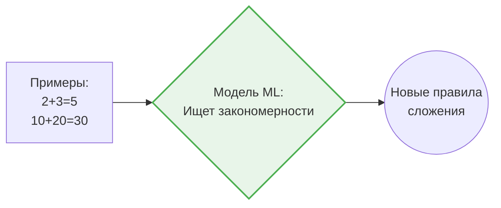
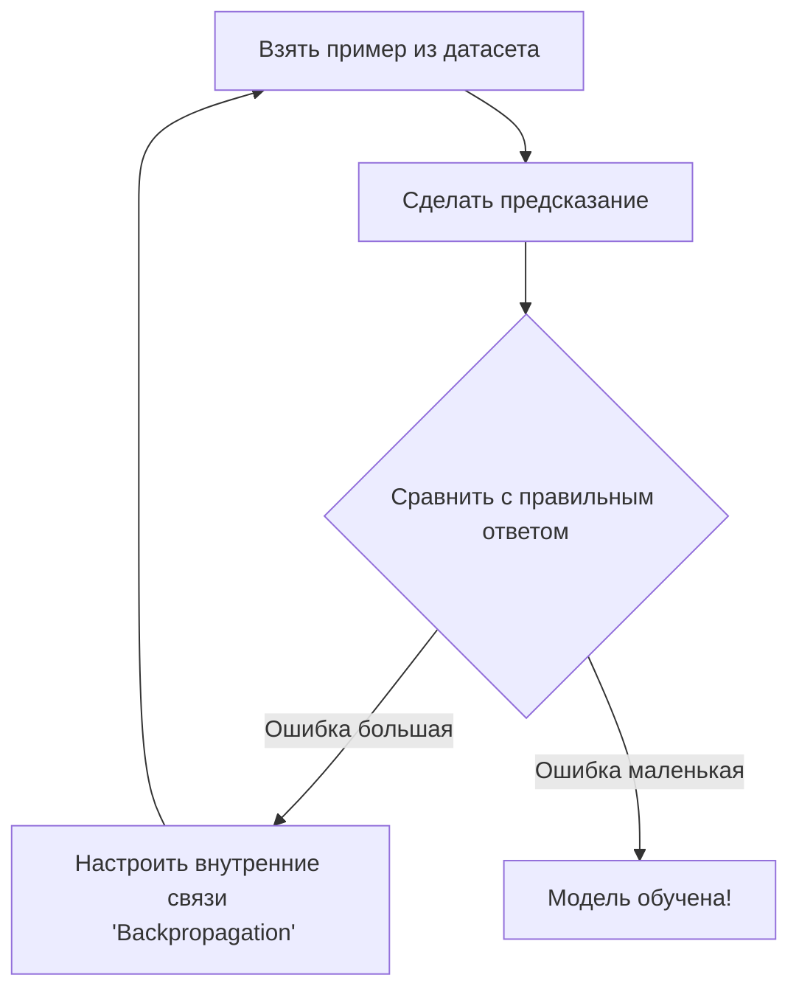
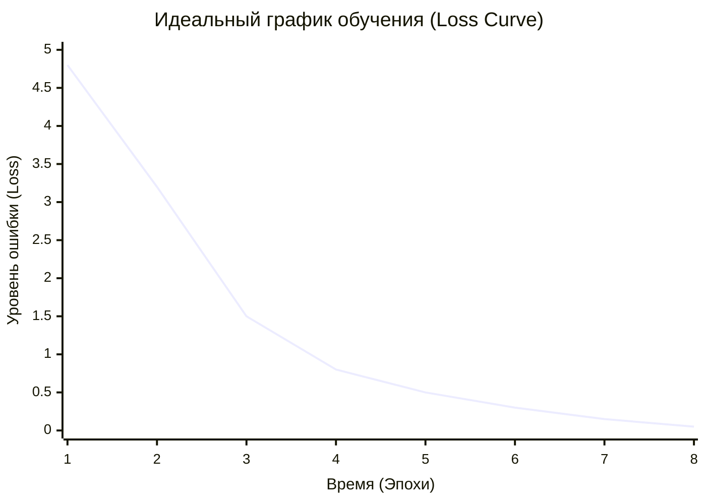
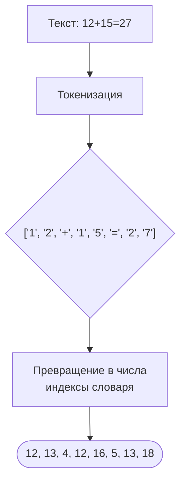
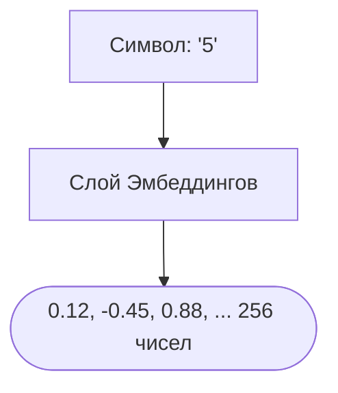
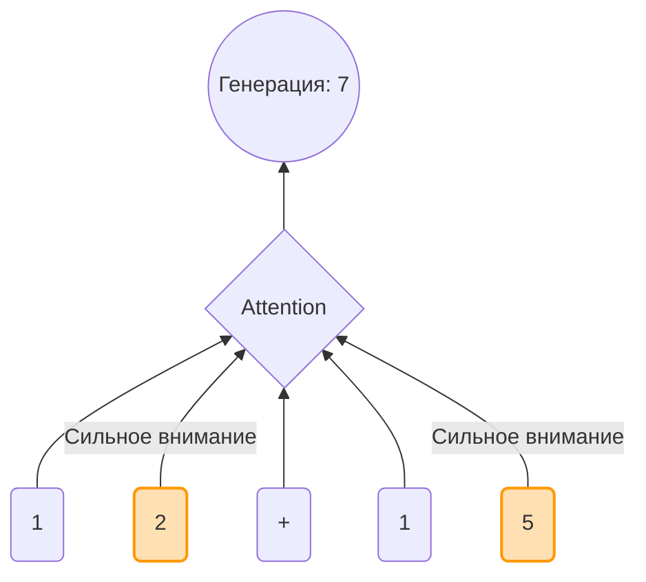
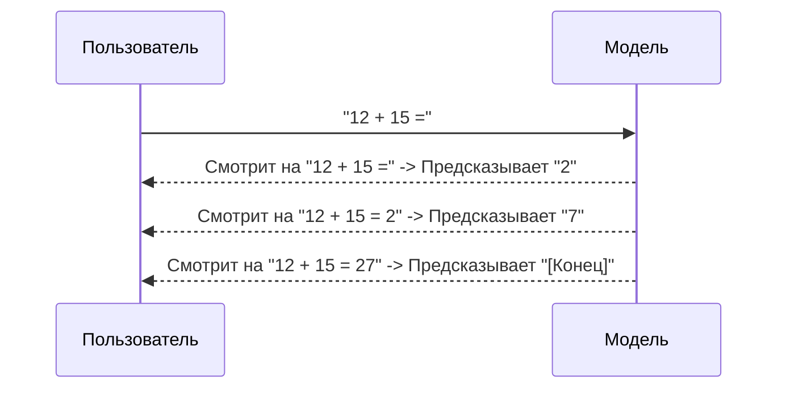

# 🧠 Что такое Машинное Обучение простыми словами?

> [!TIP]
> Прежде чем погружаться в код Pythagoras, давайте разберемся с базовыми концепциями на простых аналогиях.

---

## 📋 Оглавление
1. [Традиционное программирование vs Машинное Обучение](#1)
2. [Как учится нейросеть? (Аналогия со школой)](#2)
3. [Как измеряется успех? (График Loss)](#3)
4. [Как нейросеть читает текст? (Токенизация)](#4)
5. [Как нейросеть понимает числа? (Эмбеддинги)](#5)
6. [Как нейросеть складывает числа? (Механизм внимания)](#6)
7. [Как нейросеть генерирует ответ? (Авторегрессия)](#7)
8. [Почему Pythagoras особенный?](#8)
9. [Словарь начинающего ML-инженера](#9)

---

## 1. Традиционное программирование vs Машинное Обучение

В **традиционном программировании** человек пишет строгие правила.
Например, чтобы научить компьютер складывать числа, программист пишет: `ответ = число_А + число_Б`. Компьютер просто слепо выполняет эту инструкцию.

В **машинном обучении (Machine Learning, ML)** мы не пишем правил!
Вместо этого мы даем компьютеру огромное количество примеров, и алгоритм сам создает эти "правила".

## 2. Как учится нейросеть? (Аналогия со школой)

Представьте ученика (это наша модель Pythagoras), который готовится к экзамену по математике:

1. **Учебник (Датасет)**: Ученику дают книгу с миллионами решенных примеров.
2. **Урок (Тренировка/Training)**: Ученик смотрит на пример `12 + 15 = ` и пытается угадать ответ. Сначала он говорит `99` (потому что еще ничего не знает).
3. **Оценка (Функция потерь/Loss)**: Учитель смотрит в правильный ответ (`27`) и говорит ученику, насколько сильно он ошибся. Это число (ошибка) называется **Loss**. Чем оно меньше, тем умнее становится ученик.
4. **Работа над ошибками (Обратное распространение/Backpropagation)**: Ученик понимает, что ошибся, и меняет свои "внутренние правила" в голове, чтобы в следующий раз ответить точнее. В нейросети эти правила называются **весами**.
5. **Экзамен (Валидация/Validation)**: Ученику дают новые примеры, которых не было в учебнике. Если он решает их правильно — значит, он действительно *понял* математику, а не просто зазубрил учебник!

## 3. Как измеряется успех? (График Loss)

В процессе обучения вы часто будете встречать термин **Loss (Функция потерь)**. Это просто число, которое показывает, насколько сильно модель ошибается в данный момент.

Главная цель любого обучения нейросети — сделать Loss как можно ближе к нулю. Если вы построите график, он должен идти вниз.

*Начало обучения: модель угадывает случайно (Loss высокий). Конец обучения: модель знает правила математики (Loss почти 0).*

## 4. Как нейросеть читает текст? (Токенизация)

Нейросети не могут читать текст как люди. Им нужно разбить текст на маленькие кусочки — **токены**, а затем превратить их в числа.

В модели Pythagoras используется **посимвольная токенизация**. Это значит, что каждый символ (цифра или знак) — это отдельный токен. Для математики это критически важно: модель должна видеть каждую цифру отдельно, чтобы правильно складывать единицы с единицами, десятки с десятками и т.д.

## 5. Как нейросеть понимает числа? (Эмбеддинги)

Нейросети понимают только математические векторы (массивы чисел). После токенизации мы переводим индекс каждого символа в уникальный математический код.

Этот процесс называется созданием **эмбеддингов (Embeddings)**. Представьте себе многомерную карту: на этой карте символ "1" находится где-то в левом углу, символ "9" в правом, а знак "+" посередине. Модель учится размещать похожие по смыслу символы рядом друг с другом на этой карте.

## 6. Как нейросеть складывает числа? (Механизм внимания)

Pythagoras построен на архитектуре **Transformer**. Главная фишка трансформера — это **Механизм внимания (Attention Mechanism)**.

Когда модель решает пример `12 + 15 =`, и пытается предсказать последнюю цифру ответа (которая должна быть `7`), механизм внимания помогает ей понять, на какие символы из прошлого нужно "посмотреть внимательнее".

В данном случае, "внимание" модели фокусируется на цифре `2` и цифре `5`, потому что именно они нужны для сложения единиц.

## 7. Как нейросеть генерирует ответ? (Авторегрессия)

Нейросеть генерирует ответ не целиком сразу, а **по одной цифре за раз**. Этот процесс называется **авторегрессией**. Модель смотрит на то, что уже написано, предсказывает следующую цифру, добавляет ее к тексту и повторяет процесс!

## 8. Почему Pythagoras особенный?

Большинство современных нейросетей (как ChatGPT) — это гигантские "мозги", которые знают обо всем понемногу. Pythagoras — это маленький, сфокусированный "мозг".

Он работает на архитектуре **Transformer** (той же самой, что и буква 'T' в ChatGPT), но учится только одному — арифметике. Это делает его идеальным проектом для изучения того, как работают Трансформеры "под капотом", потому что его можно запустить на обычном домашнем компьютере.

## 9. Словарь начинающего ML-инженера

*   **Модель (Model)** — сама "программа" или "мозг", который мы обучаем. В нашем случае это алгоритм, написанный на языке Python с использованием библиотеки PyTorch.
*   **Датасет (Dataset)** — набор данных для обучения. Для Pythagoras это огромный текстовый файл со строками вроде `123+456=579\n`.
*   **Эпоха (Epoch)** — один полный проход модели по всему датасету. Как если бы ученик прочитал учебник от корки до корки один раз.
*   **Батч (Batch)** — мы не даем модели весь учебник сразу. Мы даем ей примеры небольшими порциями, например, по 64 штуки за раз. Это и есть батч.
*   **Инференс (Inference)** — процесс использования уже *обученной* модели. Когда вы пишете в чат Pythagoras пример, а он выдает ответ — это инференс.

---

  <a href="1_quick_start.md">Далее: Быстрый старт →</a> 
  Pythagoras 1.0 • Вводный курс • 2026

