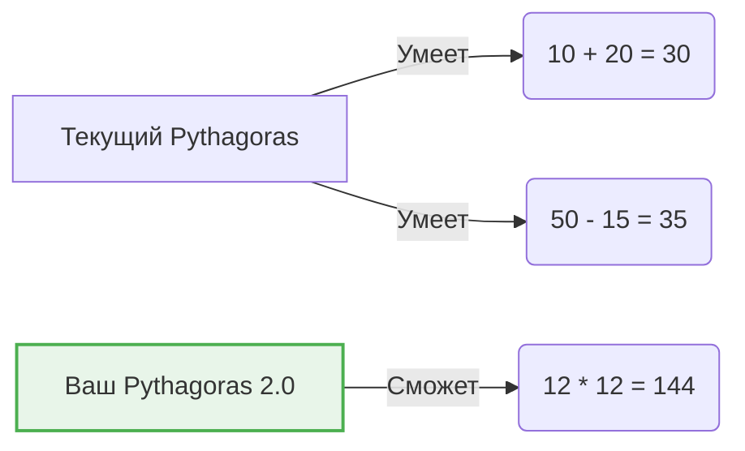
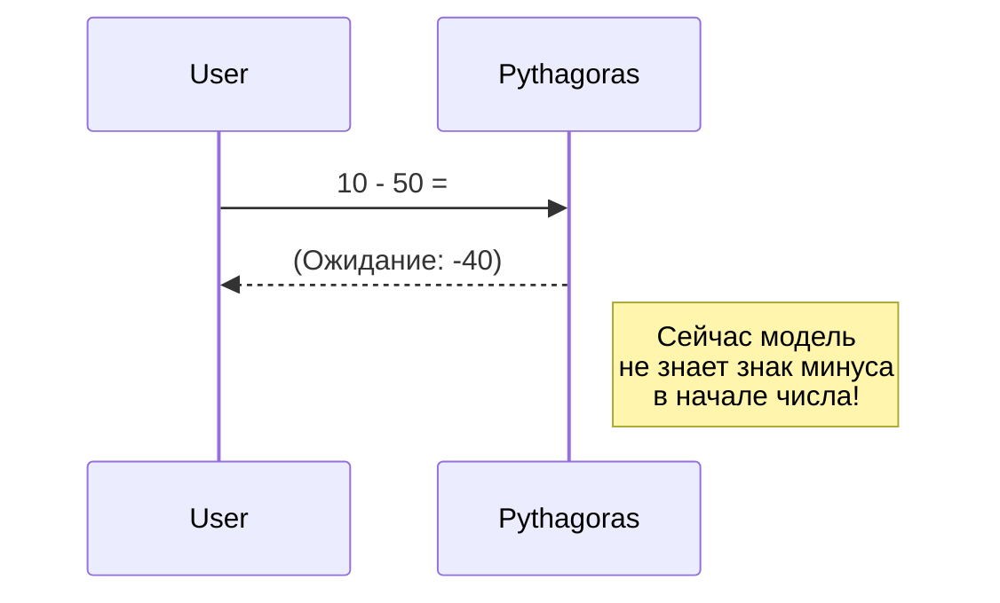
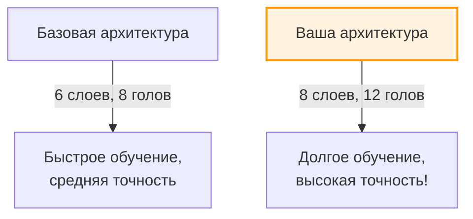

# 🤝 Как развивать проект дальше? (Для студентов)

> [!TIP]
> Pythagoras — это песочница. Вы можете ломать, экспериментировать и улучшать этот код. Вот несколько идей, как вы можете модифицировать проект, чтобы прокачать свои навыки в Python и ML.

---

## 📋 Оглавление
1. [Идея 1: Научить модель умножению](#1-идея-1-научить-модель-умножению)
2. [Идея 2: Отрицательные числа](#2-идея-2-отрицательные-числа)
3. [Идея 3: Изменение архитектуры](#3-идея-3-изменение-архитектуры)

---

## 1. Идея 1: Научить модель умножению

Сейчас Pythagoras умеет только складывать (`+`) и вычитать (`-`). Сможете ли вы научить его умножению (`*`)?



**План действий:**

1. **Откройте генератор датасета:** Файл `prep_math.py`.
2. **Добавьте новую логику:** Найдите место, где генерируются примеры, и добавьте оператор умножения `*`.

   *Пример того, что нужно добавить в код:*
   ```python
   # Псевдокод для добавления в prep_math.py
   a = random.randint(1, 99)
   b = random.randint(1, 99)
   example = f"{a}*{b}={a*b}\n"
   ```
   > ⚠️ **Внимание:** Умножение трехзначных чисел (999 * 999 = 998001) дает очень длинные результаты. Трансформеру будет сложно это выучить сразу. Возможно, стоит начать с умножения однозначных и двузначных чисел!

3. **Сгенерируйте новые данные:** Запустите скрипт, чтобы создать новый файл `input_math.txt`.
4. **Обучите модель заново:** Запустите `pythagoras_hub.py`, выберите тренировку. Модель впервые "увидит" символ `*` и со временем поймет его математический смысл.

## 2. Идея 2: Отрицательные числа

Сейчас модель работает только с положительными ответами. Что если ответ будет отрицательным? Например: `10 - 50 = -40`?



**План действий:**

1. В `prep_math.py` отключите защиту от отрицательных чисел (разрешите генерацию примеров, где вычитаемое больше уменьшаемого).
2. Убедитесь, что символ минуса `-` правильно обрабатывается токенизатором. Сейчас он используется только как знак операции посередине строки, а должен стать еще и знаком числа (в начале ответа).
3. Переобучите модель на новом датасете.

## 3. Идея 3: Изменение архитектуры

Попробуйте сделать модель "глубже" или "шире" и посмотрите, как это повлияет на скорость обучения и финальную точность.



**План действий:**

1. Откройте `pythagoras_hub.py` (или ваш скрипт обучения).
2. Измените гиперпараметры в блоке `ГЛОБАЛЬНЫЕ НАСТРОЙКИ`.

   Например:
   ```python
   # Было
   n_layer = 6
   n_head = 8

   # Стало
   n_layer = 8
   n_head = 12
   ```
3. Запустите обучение и наблюдайте за графиком Loss. Модель станет обучаться медленнее (ей потребуется больше времени на "обдумывание"), но, возможно, сможет решать более сложные логические задачи с длинным контекстом.
